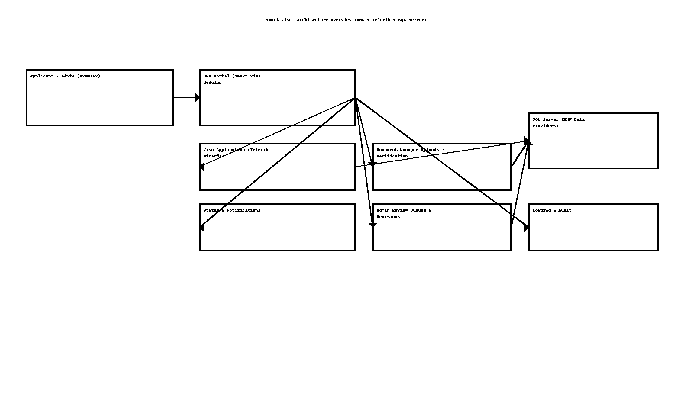

# Smart Visa — High‑Level Design (HLD)

> **Author:** Sagarika Chakraborty — Full Stack .NET Engineer | React.js | Web API | SQL Server

## 1) Overview & Scope
**Smart Visa** is a DNN‑based portal for **online visa applications**, enabling:
- Traveler **application submission**, **document upload**, and **status tracking**.
- Admin **review and decisioning** with SLA and audit trail.
- Responsive, accessible UI using **Telerik** components.

## 2) Objectives & NFRs
- **Usability**: step‑by‑step forms, contextual help, accessible controls.
- **Reliability**: draft auto‑save, resumable uploads, retry for transient failures.
- **Security**: role‑based access (Applicant, Reviewer, Admin), HTTPS, CSRF protection, input validation, content scanning for uploads.
- **Performance**: server‑side paging/sorting; caching of reference data; async file handling.
- **Maintainability**: DNN module architecture, layered DAL, configuration via Host settings.
- **Observability**: centralized logs, error dashboards, audit for state changes.

## 3) Architecture


```mermaid
flowchart LR
  A[Applicant (Browser)] --> B[DNN Portal (Smart Visa Modules)]
  B --> C[Visa Application Module]
  B --> D[Document Manager Module]
  B --> E[Status & Notifications Module]
  B --> F[Admin Review Module]
  C --> G[(SQL Server)]
  D --> G
  E --> G
  F --> G
  B --> H[Telerik UI Controls]
  B --> I[Logging & Audit]
```

## 4) Modules
- **Visa Application**: forms, validations, save draft, submit.
- **Document Manager**: uploads/previews, versioning, verification checklist.
- **Status & Notifications**: status timeline, email/SMS hooks, reminders.
- **Admin Review**: work queues, bulk actions, notes, decisioning.
- **Common Services**: user profile, reference data (countries, visa types), audit.

## 5) Key Flows (Happy Paths)
1. **Create Application** → fill multi‑step form → upload documents → **Submit**.
2. **Admin Review** → verify docs → request additional info (if needed) → **Approve/Reject**.
3. **Track Status** → applicant checks timeline and receives notifications.

## 6) Security
- DNN roles: `Applicant`, `Reviewer`, `Admin` with page/module permissions.
- CSRF/anti‑forgery tokens; input sanitization; file‑type/size validation.
- Audit entries for status changes and admin actions.

## 7) Availability & DR
- Database backups; scripted restores.
- Blue/green or staged deployments (if CI/CD used); config transforms.

## 8) CI/CD (if applicable)
- TFS/Azure DevOps: build → package module(s) → deploy to IIS site → smoke tests.
